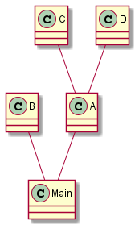

# PlantUML Generator

PlantUML Generator is a jar application to automatically generate [PlantUML](https://plantuml.com/) diagrams from source code.

Input:

```
InputFolder
|_ A.java
|_ B.java
|_ C.java
|_ D.java
|_ Main.java
```

Output:



### How to use it

The program needs two arguments:
- the path of the folder containing the input files;
- the path of the output file.

Example:

```
java -jar PlantUMLGenerator.jar input output.puml
```
