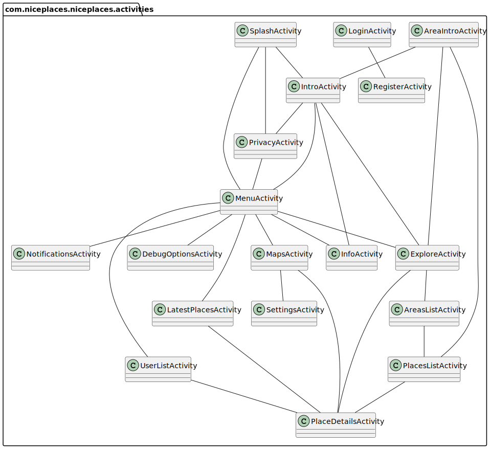
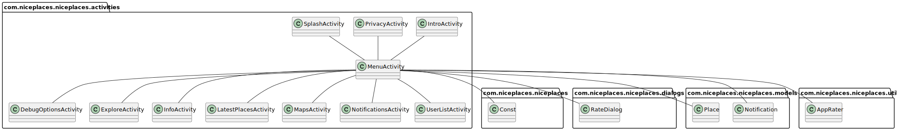

# PlantUMLGenerator


PlantUML Generator is a jar application to automatically generate [PlantUML](https://plantuml.com/) class diagrams from source code.



### Usage

1. Download the [PlantUMLGenerator jar](https://github.com/lorenzovngl/plantuml-generator/releases/download/v1.0/PlantUMLGenerator.jar).
2. Download the [PlantUML jar](https://github.com/plantuml/plantuml/releases/download/v1.2022.14/plantuml.jar) and place it in the same folder of the previous jar.
3. Open a terminal and navigate to the location of both jars and choose one of the following commands.

#### 1. Generate a class diagram for the entire project
```
java -jar PlantUMLGenerator.jar [PROJECT_ROOT_PATH] [OUTPUT_FILE_PATH].puml
```

<details><summary>View example</summary>

Example with [Nice Places Android App](https://github.com/niceplaces/android-app):
```
java -jar PlantUMLGenerator.jar niceplaces-android-app/app/src/main/java niceplaces.puml
```
</details>

#### 2. Generate a class diagram for a specific package of the project
```
java -jar PlantUMLGenerator.jar [PACKAGE_PATH] [OUTPUT_FILE_PATH].puml
```
<details><summary>View example</summary>

Example with [Nice Places Android App](https://github.com/niceplaces/android-app)

```
java -jar PlantUMLGenerator.jar niceplaces-android-app/app/src/main/java/com/niceplaces/niceplaces/activities niceplaces-activities.puml
```
</details>

<details><summary>View output</summary>


</details>

#### 3. Generate a class diagram for a specific class of the project

```
java -jar PlantUMLGenerator.jar [PROJECT_ROOT_PATH] [OUTPUT_FILE_PATH].puml [TARGET_CLASS_NAME]
```

<details><summary>View example</summary>

Example with [Nice Places Android App](https://github.com/niceplaces/android-app)

```
java -jar PlantUMLGenerator.jar niceplaces-android-app/app/src/main/java niceplaces-menuactivity.puml MenuActivity
```
</details>

<details><summary>View output</summary>



</details>

## ❤️ Support

*Building software is awesome, making it free and open source is even more so. However, this requires dedication, efforts, and time. If you use this software or find it valuable, please support my commitment in developing and maintaining this project through one or more of the following methods:*

- *Follow me on [GitHub](https://github.com/lorenzovngl), [Twitter](https://twitter.com/lorenzovngl_dev) or [LinkedIn](https://www.linkedin.com/in/lorenzovainigli/).*
- *Share or star the project.*
- *[Make a donation](https://www.paypal.com/donate/?hosted_button_id=LX8P6X75XF65A).*

*Your support would be very precious for me.*

*Thank you,*

*Lorenzo*

